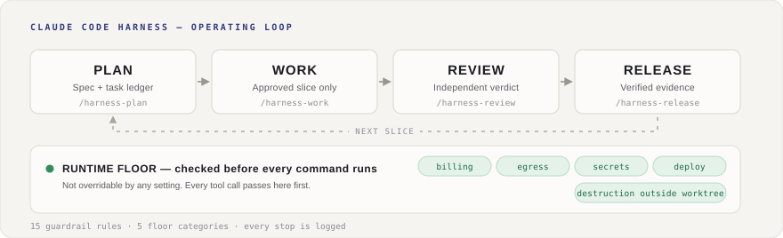

# Claude Code Harness

<p align="center">
  
</p>

<p align="center">
  <strong>Plan. Work. Review. Ship.</strong><br>
  <em>A disciplined delivery loop for Claude Code, Codex CLI, Cursor, and Grok.</em>
</p>

<p align="center">
  <a href="https://github.com/Chachamaru127/claude-code-harness/releases/latest"></a>
  <a href="LICENSE.md"></a>
  <a href="docs/CLAUDE_CODE_COMPATIBILITY.md"></a>
  
  
  
</p>

<p align="center">
  English | <a href="README_ja.md">日本語</a>
</p>

<p align="center">
  
</p>

## The problem

Agent coding drifts. Plans live in chat and disappear. Tests become optional
under deadline. Review happens after the code is already merged. Release
evidence gets reconstructed from memory.

Harness replaces "ask the agent to code" with one repeatable path:

**write the spec → implement only the approved slice → verify → review
independently → package evidence.**

It does not make the model smarter. It fixes the procedure and the boundary
around the model — so it keeps working when the model changes.

> **Claims in this README are machine-checked.** CI gates verify that described
> components are actually wired, that the task ledger stays consistent, and that
> shipped binaries rebuild from source. A feature appears here only after a gate
> proves it is reachable. *Written* is not *working*.

## Install in 30 seconds

```bash
claude
/plugin marketplace add Chachamaru127/claude-code-harness
/plugin install claude-code-harness@claude-code-harness-marketplace
/harness-setup
```

Then hand it something small:

```bash
/harness-plan Improve the README onboarding flow
```

Harness drafts `spec.md` and `Plans.md` for you. **Your job is not to write the
plan — it is to approve or correct it** before execution continues.

Using a different tool? See [install by tool](#install-by-tool) below.

## The loop

The 5 verb skills keep that surface small: plan, work, review, sync, release.
(`/harness-setup` runs once at install time, above.) Each stage leaves the
material the next stage needs, and each has its own gate.

| Command | What happens | Gate |
|---|---|---|
| `/harness-plan` | Turns intent into `spec.md` + `Plans.md`: scope, acceptance criteria, dependencies, unknowns, stop conditions. | You approve or correct the generated contract. |
| `/harness-work` | Implements one approved task. Adds tests when the task requires them. | TDD required when the task says so. |
| `/harness-work all` | Runs the whole approved plan. Use once the plan is clear and the repo baseline is known. | Same TDD gate, applied task by task. |
| `/harness-review` | Reviews the result **separately from implementation**. | Major findings block completion. PR-ready is not release-ready. |
| `/harness-sync` | Compares the plan against what is actually implemented and reports drift. | — |
| `/harness-release` | Packages only verified evidence into CHANGELOG, tag, and release. | Release preflight must pass. |

Data the agent has not seen stays `unknown` instead of being quietly invented.

## The safety layer

This is what separates Harness from a prompt template. Every tool call is
adjudicated by a Go engine **before it runs** — not reviewed after the fact,
because a file diff cannot see a network send or a deletion.

**Two layers, deliberately different in strength.**

| Layer | Decides | Overridable |
|---|---|---|
| **Runtime floor** — 5 categories | Denies outright | **No.** Not by any config, env var, or permission mode |
| **Guardrails** — R01–R15 | Deny / confirm / warn | Partly, by project config |

The floor covers billing, network egress, secret reads, production deploys, and
destruction outside the task worktree. It sits on an isolated code path with no
disable switch, so an autonomous run cannot talk itself past it.

Guardrails are the layer you tune. Direct pushes to `main`, writes to protected
paths, forced pushes, history rewrites — each has a defined verdict, and some
are configurable per project.

**Confirmations move to plan time.** Instead of interrupting a run, Harness
collects the risky operations a plan will need and asks once, up front.
Approvals carry an expiry, a task scope, and a use limit — so one approval never
becomes a permanent hole.

**Every stop is recorded.** Rule id, category, and verdict land in a JSONL log.
Command text is never written; only a hash and a length, and for secret-read and
billing not even that. You can count what actually blocked you instead of
guessing.

## Sessions that can see each other

Open three agents on one repo and they normally work blind to each other. That
is not a small inefficiency: on CooperBench, two agents editing the same file
succeed about half as often as one agent working alone, and 63% of the failures
trace to a false belief about what the other one changed.

Harness keeps a roster and a message path between local sessions.

| Piece | What it does |
|---|---|
| Roster | `bin/harness session list` shows every live session on this machine — including sessions in other worktrees, because the store resolves from `git --git-common-dir`. Each row carries the `team` and `agent` a sender needs. |
| Send | `bin/harness inbox send --team <t> --from <a> --to <b> --subject <s> "<body>"`, or the `session-send` skill, which also documents what is worth sending. |
| Receive | Messages arrive at the receiving session's turn boundary, wrapped as data with an explicit non-instruction envelope. A peer's message is a report to verify, never an order to follow. |

The pipeline is the product; what you route through it is your call. Sending
is unfiltered by default. Setting `[livemsg] verification = "on"` adds a gate
that checks a message's factual claims — mentioned files exist, mentioned
commits resolve, a "clean worktree" claim matches `git status` — and returns
the reason to the sender instead of delivering a false one. While it is `off`,
the send path does not call the gate at all.

This is local-only and does not depend on harness-mem. If harness-mem is
installed alongside, its roster entries are preserved untouched.

## Decision surfaces for non-engineers

Three single-screen HTML views let a non-engineer sponsor judge without reading
code.

| Surface | When | Shows |
|---|---|---|
| **Plan Brief** | Plan finalized | Understanding, options, risks, acceptance criteria |
| **Progress** | During work | WIP/TODO/done counts and drift alerts, auto-regenerated |
| **Acceptance** | Before release | Per-criterion pass/fail with ship / wait / reject |

## Install by tool

Four install routes are **not** four identical guarantees. A setup script means
a tool has an *entry path*, not a shared product promise.

| Tool | Tier | Route |
|---|---|---|
| Claude Code | `supported` | Plugin marketplace, then `/harness-setup` |
| Codex CLI | `supported` | [`scripts/setup-codex.sh --user`](codex/README.md#option-1-script-recommended-user-based); rerun after Harness updates, then restart Codex |
| Cursor | `supported` | `scripts/setup-cursor.sh` — containment is harness-side, see [notes](docs/CURSOR_INTEGRATION.md) |
| Grok | `supported` | `scripts/setup-grok.sh` |
| Codex app | `candidate` | Candidate smoke only; CLI proof is not reused |
| OpenCode | `internal-compatible` | `scripts/setup-opencode.sh`; runtime parity not claimed |
| Hermes Agent | `candidate` | Manual symlink research route. `harness gen` now writes its turn-delivery hook when `~/.hermes` exists; guardrail enforcement is still not wired, so the tier is unchanged |
| GitHub Copilot CLI | `candidate` | Manual profile research |
| Antigravity CLI | `future/unsupported` | No end-user install route yet |

<details>
<summary><strong>What the tiers mean, and why we are strict about them</strong></summary>

<br>

| EN tier | Japanese public wording |
|---|---|
| `supported` | 正式対応 |
| `internal-compatible` | 互換利用可 / 制限付き対応 |
| `candidate` | 試験対応 / プレビュー |
| `future/unsupported` | 非対応 / 将来検討 |

Claude Code, Codex CLI, Cursor, and Grok passed H1–H8 on their verified claim
paths (live H4 2026-07-17; H7 release-preflight fail-closed wiring 2026-07-19).
Every other row stays at its listed tier until it passes its own H1–H8
(`docs/spec/planning-and-host-adapter.md`, Phase 111).

Harness does not inherit support claims from Superpowers, Hermes Agent, or any
other project. A host moves up only when Harness has its own bootstrap, trigger,
runtime, and release evidence.

`not_observed != absent` — missing local proof means "not proven here". It does
not mean impossible, and it does not mean supported.

</details>

<details>
<summary><strong>Already using Harness? Run the migration report first</strong></summary>

<br>

```bash
bin/harness doctor --migration-report
```

It inventories stale Claude plugin caches, duplicate Codex skills, old symlinks,
OpenCode backup paths, and harness-mem state — **without deleting anything**.

</details>

<details>
<summary><strong>Advanced capabilities</strong></summary>

<br>

Reach for these after the basic path is working.

| Capability | What it adds | Boundary |
|---|---|---|
| **Breezing** | Planner / Critic / Worker team execution for larger task lists | Still gated by plan quality and review |
| **Codex companion review** | Schema-backed second opinion via `scripts/codex-companion.sh` | Raw `codex exec` is not the companion path |
| **harness-mem** | Project-scoped memory and recall across sessions | Optional; purge stays explicit |
| **OpenCode bootstrap** | Mirrors guidance into OpenCode-compatible surfaces | Runtime parity not claimed |
| auto-approve *(experimental)* | `HARNESS_AUTO_APPROVE=on` records the gate result in the orchestration ledger | Default OFF. Approval prompts are **not** skipped yet |

**Codex Breezing role routing.** After setup is rerun and Codex is restarted,
Codex-native `$breezing` selects the managed Worker profile. `$breezing --codex`
uses the companion Worker route. Both implementation Workers use
`gpt-5.6-luna` / `max`; the routed Codex review route uses `gpt-5.6-sol` /
`xhigh`. The main Codex session model stays unpinned, and explicit backends such
as Cursor keep their own routing. See [activation and
boundaries](codex/README.md#codex-breezing-role-routing).

</details>

## Requirements

- **Claude Code v2.1+** for the supported Claude path
- A repository with write access
- No Node.js is required for the Go-native guardrail engine
- Optional: [harness-mem](https://github.com/Chachamaru127/harness-mem) for
  cross-session memory

## Documentation

| Resource | Description |
|---|---|
| [Tool-first onboarding](docs/onboarding/index.md) | Where to start, by host tool |
| [Install routes](docs/onboarding/install.md) | Per-tool setup and tier boundaries |
| [Migration check](docs/onboarding/migration.md) | Existing-user impact and rollback |
| [Skill trigger gate](docs/onboarding/skill-trigger-acceptance.md) | How install success is verified |
| [Capability matrix](docs/tool-capability-matrix.md) | Full host claim table |
| [Distribution scope](docs/distribution-scope.md) | Included vs compatibility vs dev-only |
| [Hardening parity](docs/hardening-parity.md) | Safety differences between hosts |
| [Work All evidence pack](docs/evidence/work-all.md) | Verification contract for full-plan runs |
| [Language / i18n](docs/i18n.md) | Switching output language |
| [Changelog](CHANGELOG.md) | User-facing version history |

## Contributing

Issues and PRs welcome. See [CONTRIBUTING.md](CONTRIBUTING.md).

## Acknowledgments

- [AI Masao](https://note.com/masa_wunder) — hierarchical skill design
- [Beagle](https://github.com/beagleworks) — test tampering prevention patterns

## License

MIT. See [LICENSE.md](LICENSE.md).
